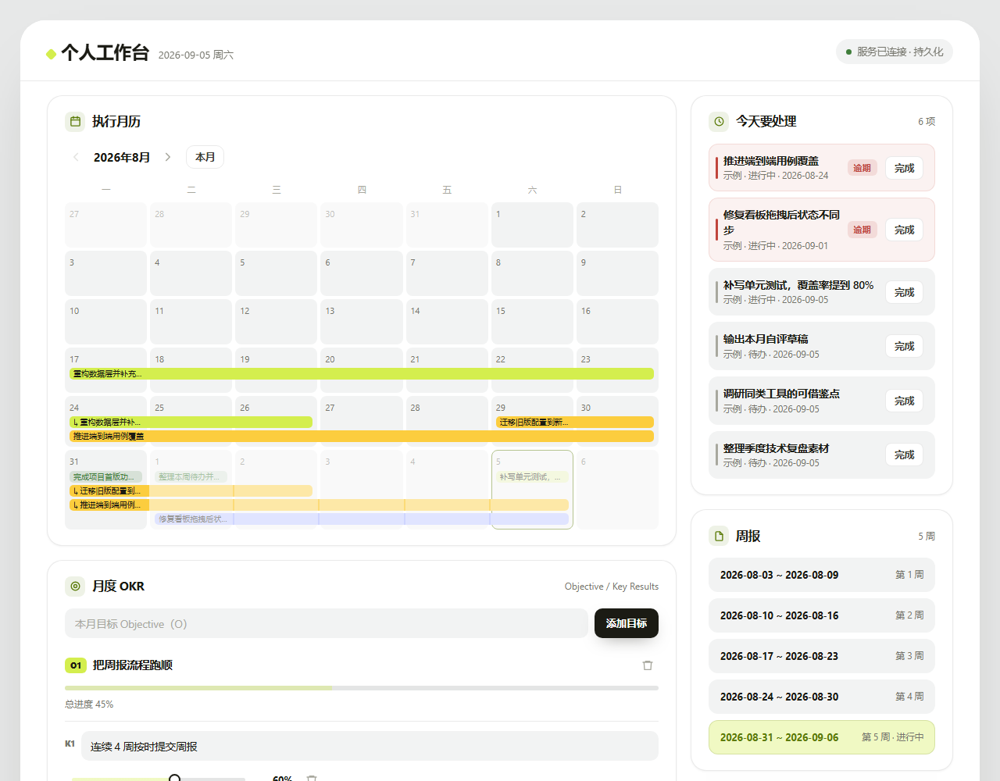
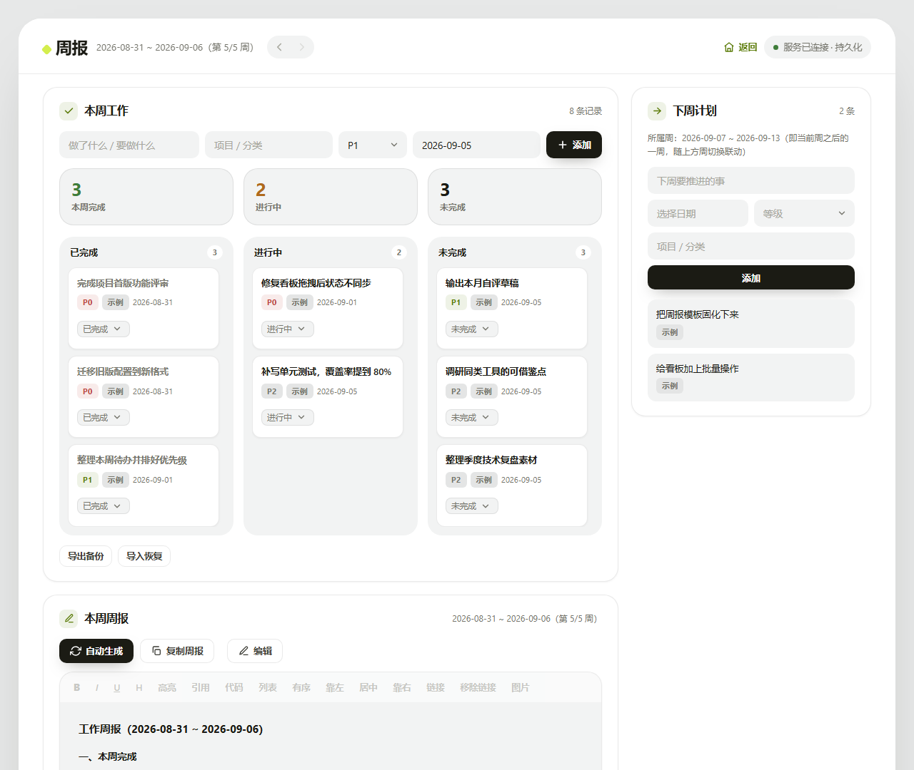
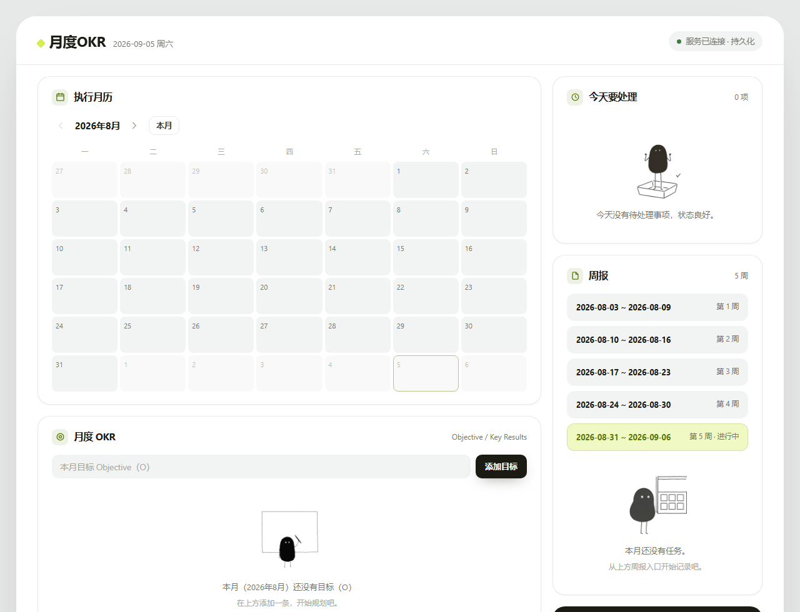
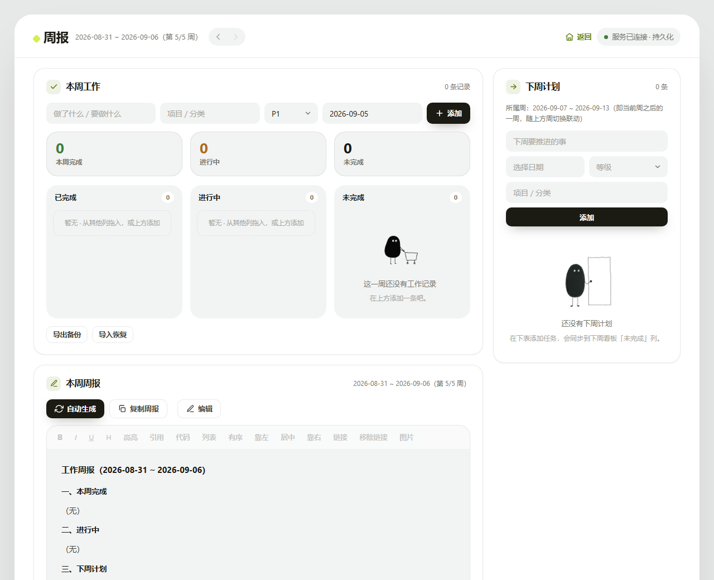

# 周报工作台 · WeeklyDashboard

一个 **本地优先（local-first）** 的周报与 OKR 工作台：两个单文件 HTML 页面 + 一个零依赖 Python 服务，数据落在本地 SQLite，多浏览器、多设备访问同一份数据，重启不丢。

没有构建步骤、没有 npm、没有 requirements.txt —— `python server.py` 就能跑。

| | |
|---|---|
| 首页（`/`） | 执行月历 · 月度 OKR · 今天要处理 · 周报 · OKR 完成情况 |
| 周报页（`/week`） | 本周工作看板 · 本周周报（富文本）· 下周计划 |

下面是**首次启动、自动播种示例数据**后的样子：





**空数据状态**





---

## 功能

**本周工作**
- 三列看板（未完成 / 进行中 / 已完成），卡片可**直接拖拽**换列
- 每条记录带项目分类、优先级（P0/P1/P2）、**截止日期**；卡片上可下拉改状态、编辑、删除
- **归周口径**：已完成的按**完成日期**（`doneAt`，为空时兜底用截止日期）归属；未完成的（未开始 / 进行中）不按日期归周，一律挂在**现实中的当前周** —— 现实时间前进一周，这批卡片整体挪到下一周
  - 推论：翻看历史周时只显示当周完成的项；把卡片拖成「已完成」时它原地不动（完成日 = 今天，本就在当前周内）
  - 在编辑弹窗里手动改「结束时间」，会让这张卡跳到那一天所在的周
- 编辑弹窗里除截止日期外，还可手填**开始时间 / 结束时间**（留空表示未开始 / 未完成）
  - ⚠️ 这两值会被状态流转覆盖：拖动卡片换列时 `setStatus` 按六条规则重刷它们
- 顶部 KPI 实时统计本周完成 / 进行中 / 未完成

**本周周报**
- 富文本编辑器：加粗、列表、插入链接与图片、粘贴图片直接入库
- **默认只读**，点「编辑」才进入编辑态；点「保存」提交落库
- 编辑期间的内容是草稿，**不保存就关页面 = 丢弃**；切换周次或返回首页会**自动保存**
- 「自动生成」按本周看板内容拼出周报草稿，「复制周报」一键带走

**下周计划**
- 填写下周要推进的事，会**自动同步**到下一周看板的「未完成」列，不用录两遍

**首页（月度 OKR）**
- 执行月历：一眼看全月每一天的事项分布
- 月度 OKR：目标（O）+ 关键结果（KR）两级，KR 进度可调

**通用**
- 导出 / 导入 JSON 备份

---

## 快速开始

### 方式一：Docker（推荐）

```bash
docker compose up -d
# 打开 http://localhost:7878/
```

`restart: unless-stopped`，开机自动拉起。数据持久化在宿主机 `./data/weekly.db`，容器重建不丢。

> ⚠️ `docker-compose.yml` 里的 `- .:/app` 挂载**不能删**：Dockerfile 刻意不 `COPY` 运行文件，页面和后端全靠这个挂载提供。好处是**改宿主机的 HTML / Python 即时生效，不用重建镜像**。

### 方式二：本地 Python

零第三方依赖，Python 3.9+ 即可。

| 终端           | 命令                                                         |
| :------------- | :----------------------------------------------------------- |
| **CMD**        | `set DB_PATH=./data/weekly.db` 回车<br>`python server.py`    |
| **PowerShell** | `$env:DB_PATH="./data/weekly.db"` 回车<br>`python server.py` |
| **Git Bash**   | `DB_PATH=./data/weekly.db python server.py`                  |

> ⚠️ **`DB_PATH` 陷阱**：`server.py` 默认把库放在**项目根目录**的 `weekly.db`。如果用 Docker 部署过，真数据在 `./data/weekly.db`，裸跑 `python server.py` 会在根目录新建一个**空库**，页面一片空白、看着像数据丢了。
>
> 端口同样可用 `PORT=8080 python server.py` 覆盖（默认 7878）。两种方式**端口互斥**，同时跑会撞 `Address already in use`。

---

## 目录结构

```
WeeklyDashboard/
├── server.py              # 后端：页面托管 + /api/data 读写（纯标准库）
├── 月度OKR.html           # 首页（CSS / JS 全内联，单文件）
├── 周报工作台.html         # 周报页（CSS / JS 全内联，单文件）
├── assets/                # 空状态插画等静态资源，由 /assets/* 提供
├── data/weekly.db         # SQLite 数据文件（容器卷挂载点）
├── Dockerfile             # python:3.12-slim，零依赖
├── docker-compose.yml
└── docs/screenshots/      # README 用图（示例数据版 + 空数据版各 2 张）
```

---

## 数据存储

SQLite，6 张规范化表：

| 表 | 内容 |
|---|---|
| `work_items` | 工作项（`deadline` 截止日期 + `doing_at` / `done_at` 开始 / 结束时间） |
| `next_plans` | 下周计划（`week_monday` 标记所属周） |
| `weekly_reports` | 周报正文（富文本 HTML，`week_monday` 主键） |
| `objectives` | 月度 OKR 目标（`month = "YYYY-MM"`） |
| `key_results` | KR，外键挂在 objective 上，级联删除 |
| `app_settings` | 全局设置（工作台名称、当前周、当前月） |

契约外的字段统一落进各表的 `extra` JSON 列，读出时合并回去，**升级不会丢数据**。

**备份**：页面上有「导出备份」按钮，会下载一份完整 JSON（含全部工作项、计划、周报、OKR）。也可以直接拷 `data/weekly.db`。

---

## HTTP API

只有两个接口，前端每次提交的是**整份状态快照**。

### `GET /api/data`

```jsonc
{
  "items":   [ { "id": "...", "content": "...", "project": "...",
                 "priority": "P0", "status": "done",
                 "deadline": "2026-09-01",   // 截止日期（2026-09-24 前叫 date）
                 "doingAt": "2026-08-30",    // 开始时间（可编辑；状态流转亦会写入）
                 "doneAt":  "2026-09-01" } ],// 结束时间（可编辑；状态流转亦会写入）
  "next":    { "2026-09-07": [ { "id": "...", "content": "..." } ] },
  "reports": { "2026-08-31": "<p>本周...</p>" },
  "okr":     { "2026-09": [ { "id": "...", "title": "...",
                              "krs": [ { "id": "...", "text": "...", "progress": 60 } ] } ] },
  "title": "工作台名称",
  "viewWeek": "2026-08-31",
  "viewMonth": "2026-09",
  "__v": 272
}
```

### `PUT /api/data`

请求体同上（去掉 `__v` 由服务端比对也行，带上则做乐观锁校验）。

- 校验通过 → `200 {"ok": true, "__v": <新版本号>}`
- 版本不一致 → `409 {"error": "数据已被其他页面更新，请刷新页面后再操作", "current": <当前版本>}`

> **乐观锁**：`GET` 时拿到的 `__v` 必须原样带回。版本对不上说明这个页面加载后数据已被别处改过，服务端拒绝写入，防止持有过期状态的页面把整份数据盖掉。
> 版本读取与快照写入在**同一个 `BEGIN IMMEDIATE` 事务**内完成，避免并发下的「先读后写」竞态。

### 页面与静态资源

| 路径 | 内容 |
|---|---|
| `/`、`/index.html`、`/okr` | 首页（月度 OKR） |
| `/week` | 周报工作台 |
| `/assets/*` | 静态资源（做了目录穿越防护） |

---

## 环境变量

| 变量 | 默认值 | 说明 |
|---|---|---|
| `PORT` | `7878` | 服务端口 |
| `DB_PATH` | `<项目根>/weekly.db` | SQLite 文件路径，容器部署指向 `/data/weekly.db` |

---

## 常见问题

**页面一片空白 / 数据没了**
先看服务读的是哪个库：启动时终端会打印 `数据持久化于 <路径>`。用 Docker 的话应该是 `/data/weekly.db`；本地裸跑默认是项目根的 `weekly.db`，两个不是同一个文件。

**提示「数据已被其他页面更新」**
开了多个标签页，其中一个改动后另一个的版本号就过期了，刷新页面即可。

**改了 HTML 没生效**
Docker 部署下需要 `- .:/app` 挂载（默认已配）。确认容器里的文件确实变了：
`curl -s localhost:7878/week | grep -c 某个新加的关键词`

**端口起不来**
`Address already in use` —— 容器和本地 `python server.py` 抢同一个 7878。停掉一个：`docker stop weekly-dashboard`。

---

## License

MIT
